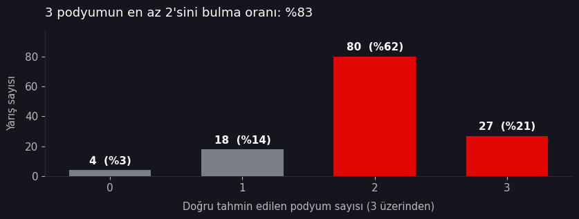
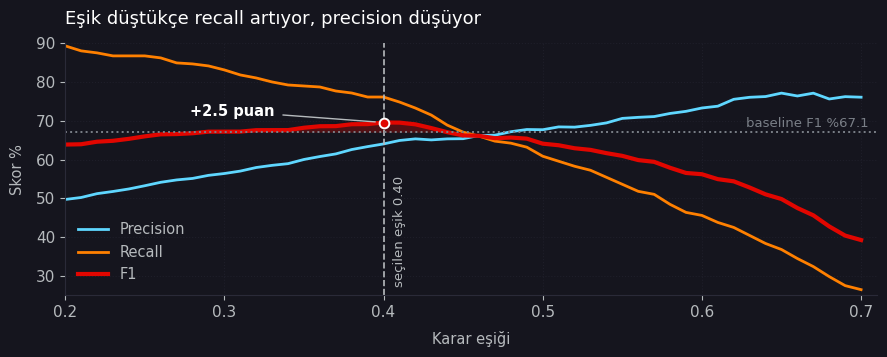
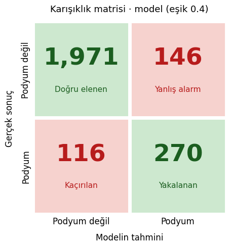
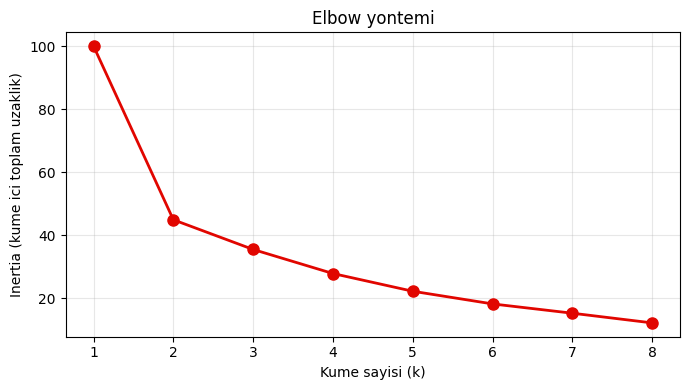
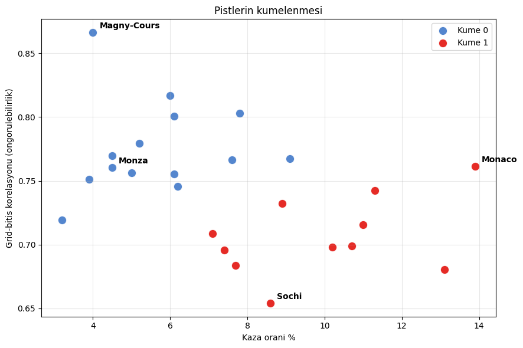
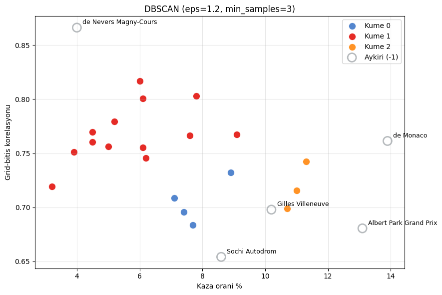

# What Decides a Formula 1 Race — the Car, the Driver, or Luck?

An end-to-end analytics project on 75 years of Formula 1 results: a dbt + BigQuery
pipeline, six statistical hypotheses, a logistic regression model, and a Power BI
dashboard.

**Scope:** 1950–2024 · 26,759 driver-race records · 1,125 races
**Stack:** BigQuery · dbt · Python (scikit-learn, SciPy) · Power BI

<!-- Replace with a dashboard screenshot once exported -->


---

## Headline findings

**Starting position is the backbone, but it isn't the whole story.** Among drivers
starting from the same grid group (P1–P3), podium rate falls from 72.6% to 9.1% as
team form deteriorates (χ²=45.7, p<0.001, n=934).

**Qualifying pace is a poor proxy for race pace.** Out-qualifying your teammate
translates into finishing ahead only 63.7% of the time. When the gap drops below
0.1 seconds, that falls to 50.2% — a coin flip (χ²=538.8, p<0.001, n=7,047).

**Difficult circuits break the hierarchy through crashes, not overtaking.**
Accident rate correlates negatively with predictability across 25 circuits
(r=−0.438, p=0.028). Monaco and Monza have near-identical predictability (0.761 vs
0.760) but completely different mechanisms: 13.9% vs 4.5% accident rate, with
*identical* mechanical failure rates (11.6% vs 11.7%).

**Rain amplifies the driver, not the car.** Teammate finishing gaps widen 14.9% in
wet conditions (ANOVA F=11.98, p<0.001), yet the grid-to-finish correlation barely
moves (0.752 dry vs 0.714 wet). The car hierarchy holds; the driver differential
grows inside it.

**A model barely beats the naive rule.** Logistic regression reaches F1 = 69.6%
against a 67.1% baseline — and only after threshold tuning. At race level it doesn't
beat it at all.

---

## The data quality fix that changed the story

Early on, 1980s DNF rates looked implausibly high. Investigating the `dnf_other`
status bucket revealed that **76% of it (1,613 records) were drivers who never
started the race** — "Did not qualify" (1,025), "Did not prequalify" (331),
"Withdrew" (248), "107% Rule" (9).

These were being counted as mechanical-era retirements. The distribution confirmed
it: `dnf_other` peaked at 15.3% in the 1980s — the pre-qualifying era, when more than
30 cars competed for a grid slot — and collapsed to 1.5% from the 2000s on.

**The fix** introduced a distinct `dns` category and a `did_start` boolean in
`stg_status`, then propagated through the pipeline:

| Change | Before | After |
|---|---|---|
| 1980s DNF rate | 61.5% | **54.5%** |
| 1990 DNF rate | 62.4% | **51.1%** |
| Pit lane starts (flag was contaminated) | 1,638 | **128** |
| Form metrics affected | — | 3,223 records corrected |
| 2010s DNF rate | 25.9% | 25.9% (unchanged) |

Two secondary bugs surfaced along the way:

- **`pit_lane_start` was 92% wrong.** DNQ entries have `grid_position = 0` in the raw
  data, so the flag was reading "no grid slot" as "started from the pit lane."
- **A silent `NULL` fallthrough.** Once `grid_position` became `NULL` for DNS rows,
  `NULL <= 3` evaluated to `NULL`, no `WHEN` branch matched, and all 1,613 records
  landed in the `11+` grid bucket. The `IS NULL` branch has to come first.

Modern-era numbers barely moved, so the reliability narrative survived — the
historical measurement was simply inflated.

---

## Hypotheses and results

| # | Hypothesis | Result | Evidence |
|---|---|---|---|
| H1 | Team form shifts podium rate within the same grid group | Confirmed | χ²=45.7 · p<0.001 · n=934 |
| H2 | Qualifying advantage transfers to race results | Confirmed | χ²=538.8 · p<0.001 · n=7,047 |
| H3 | DNFs rise in the first season of a regulation era | Partial | +2.9 pts · p=0.036 · 14 eras |
| H4 | Overtaking difficulty breaks the grid hierarchy | Confirmed in reverse | r=−0.438 · p=0.028 · n=25 circuits |
| H5 | The first-season DNF increase clusters in opening races | Not confirmed | Opening premium +6.1 vs +5.8 · interaction p=0.904 |
| H6 | Driver effect grows in difficult conditions | Partial | ANOVA F=11.98 · p<0.001 |

H4 is confirmed in the opposite direction from the original claim: predictability
drops at difficult circuits, but crashes drive it, not overtaking difficulty.

H5 was re-specified mid-project. The original wording measured something the evidence
column didn't support, so it was redefined and tested with a control group. Opening
races do show elevated DNF rates (+6.1 pts, p=0.031) — but so do opening races in
*every* season (+5.8 pts, p<0.001). Without the control group this would have looked
like a regulation effect.

---

## The prediction model

**Problem.** Can a podium finish be predicted from pre-race information alone?

**Baseline.** The project already had a one-line rule: *if grid ≤ 3, predict podium.*
Anything more complex has to beat it.

**Why logistic regression.** Binary classification, interpretable coefficients, and
within the scope of the analytics curriculum this project was built for. A tree
ensemble might score higher, but it can't tell you *why*.

**Setup.** 2003–2024 · 6,328 records after filtering · temporal split (train
2003–2016, test 2017–2024) · `StandardScaler` · features restricted to information
available before lights out.

### Results on the held-out test set

| Model | Precision | Recall | F1 | Accuracy |
|---|---|---|---|---|
| Predict nothing | 0.0 | 0.0 | 0.0 | 84.6 |
| Baseline (grid ≤ 3) | 67.4 | 66.8 | **67.1** | 89.9 |
| Logistic regression (t=0.50) | 67.7 | 60.9 | 64.1 | 89.5 |
| Logistic regression (t=0.40) | 64.1 | 76.2 | **69.6** | — |



**Accuracy is misleading here.** A model that predicts nothing scores 84.6%, because
85% of records aren't podiums. Any evaluation without a confusion matrix is
meaningless on this problem.

**The default threshold loses.** At 0.50 the model underperforms the baseline. The
gain only appears after lowering the threshold to 0.40 — and even then it's 2.5
points, driven entirely by recall (294 podiums caught vs 258) at the cost of 40 extra
false alarms.

**Coefficients confirm the thesis.** `grid_position` −1.964 · `driver_form_5_pos`
−0.625 · `team_form_5_pos` −0.430. Grid carries roughly 1.9× the weight of both form
features combined. Signs are negative because all three variables are better when
smaller.

---

## Race-level prediction

Ranking drivers by predicted probability within each race answers a more concrete
question: *can the model call the podium?*



Across 129 test races:

| | Model | Baseline (grid order) |
|---|---|---|
| Winner predicted correctly | 50.4% | 50.4% |
| Podium hit rate (of 3) | 2.01 / 3 (66.9%) | 2.02 / 3 (67.2%) |

**The model does not beat the baseline at race level — it ties it.** It gets at least
two of three podium places right in 107 of 129 races (82.9%), but so does simply
reading the grid.

Its one real advantage is that it produces *probabilities* rather than a fixed rule.
The 2024 Abu Dhabi GP is a clean example — Norris 78.4%, Sainz 53.5%, Piastri 53.1%,
with two of the three actually finishing on the podium.

### What didn't work

Richer features were tested on a temporal split, added incrementally:

| Feature set | F1 |
|---|---|
| Grid + form + pole | 62.5 |
| + teammate qualifying gap | 62.6 |
| + weather & circuit (47 columns) | 62.4 |

**Nothing helped.** Qualifying gap adds 0.1 points; weather and circuit take it back.
All three sit below the baseline.

Two reasons, both of which turned out to be findings:

- **Qualifying gap is already inside `grid_position`.** The grid *is* the qualifying
  result; the teammate delta carries no new information on top of it.
- **The circuit scrambles the field, not the front.** Drivers starting P1–P3 reach the
  podium 63.0% of the time at predictable circuits and 59.9% at risky ones — a
  3-point ceiling, buried under the noise of 36 one-hot columns.

Circuit information was also encoded four other ways (accident rate, cluster label,
target encoding, a grid × circuit interaction). None moved F1 by more than 0.1 points.

### Known limitation

The decision threshold was selected on the test set. The correct approach is a
separate validation split. This iteration used a two-way split for simplicity, so the
reported F1 is slightly optimistic.

---

## Clustering

An unsupervised check on H4: given four circuit features and no labels, does the
algorithm rediscover the Monaco/Monza distinction?

| | | |
|---|---|---|
|  |  |  |

**It does.** K-Means places Monaco and Monza in different clusters despite their
near-identical predictability scores — the split comes entirely from accident rate.
DBSCAN independently flags five circuits as outliers: Magny-Cours (unusually
predictable) and Monaco, Albert Park, Gilles Villeneuve, Sochi (unusually chaotic).

The elbow curve points to k=2; k=4 was chosen because all four clusters were
interpretable and the 2→3→4 drops are comparable. That choice is a judgement call, and
it's stated as one.

---

## Pipeline architecture

```
Kaggle F1 CSVs ──┐
                 ├──► GCS ──► BigQuery ──► dbt ──► Power BI
Open-Meteo API ──┘                          │
                                            └──► Python (SciPy, scikit-learn)
```

**dbt layers**

```
staging/       stg_results · stg_races · stg_status · stg_qualifying
               stg_drivers · stg_constructors · stg_circuits · stg_race_weather

intermediate/  int_pre_race_features      derived flags, rolling form windows,
                                          teammate comparisons, weather join
               int_results_modern_points  championship rescoring

marts/         mart_race_results          one row per driver-race, analysis-ready
               mart_circuit_stats         per-circuit predictability and risk
               mart_season_reliability    DNF breakdown by season and era
               mart_championship_comparison
```

44 dbt tests, all passing. Weather is joined on a three-hour window around each race
start and classified as dry / damp / wet.

---

## Dashboard

Six pages in Power BI on a custom dark theme (`#15151E` background, `#E10600`
accent).

| Page | Question |
|---|---|
| Overview | What are we asking, and what did the six hypotheses find? |
| Car | How much does the machine decide? |
| Driver | How much difference does the driver make? |
| Luck | How much room is left for chance? |
| Conclusion | Three factors, three mechanisms |
| Model | Can it be predicted? |

The `.pbix` file is not included. The theme definition is at
`dashboard/F1_Dark_Theme.json`.

---

## Notebooks

| Notebook | Contents |
|---|---|
| `01_podium_prediction_model.ipynb` | Baseline comparison, logistic regression, threshold tuning, coefficients |
| `02_race_level_prediction.ipynb` | Per-race winner and podium prediction, temporal vs random split, incremental feature experiment |
| `03_classification_and_clustering.ipynb` | Classification recap plus K-Means and DBSCAN on circuits |

Written for Google Colab — the first cell authenticates against BigQuery. Outputs are
committed so results are readable without running anything.

---

## Running it yourself

**Prerequisites:** a GCP project with BigQuery enabled, dbt (Core or Cloud), Python
3.10+.

```bash
# 1. Get the data
#    https://www.kaggle.com/datasets/rohanrao/formula-1-world-championship-1950-2020
#    Load the CSVs into a BigQuery dataset.

# 2. Configure dbt
#    Set your project, dataset and location in profiles.yml (not tracked here).

# 3. Build
dbt deps
dbt build
```

---

## Repository layout

```
models/          dbt models (staging · intermediate · marts)
seeds/           regulation_eras.csv — hand-curated era definitions
macros/          lap_time_to_ms.sql
notebooks/       analysis and modelling
figures/         charts exported from the notebooks
dashboard/       Power BI theme definition
```

---

## Data sources and licensing

**Formula 1 results** — [Kaggle: Formula 1 World Championship
(1950–2024)](https://www.kaggle.com/datasets/rohanrao/formula-1-world-championship-1950-2020),
derived from the Ergast Developer API (CC BY-NC-SA 3.0). Raw data is not
redistributed here.

**Weather** — [Open-Meteo Historical Weather
API](https://open-meteo.com/en/docs/historical-weather-api).

Code in this repository is MIT licensed. Formula 1, F1 and related marks are
trademarks of Formula One World Championship Limited; this project is educational and
unaffiliated.

---

Built by **Emir Kaan Üngül** as a data analytics capstone.
